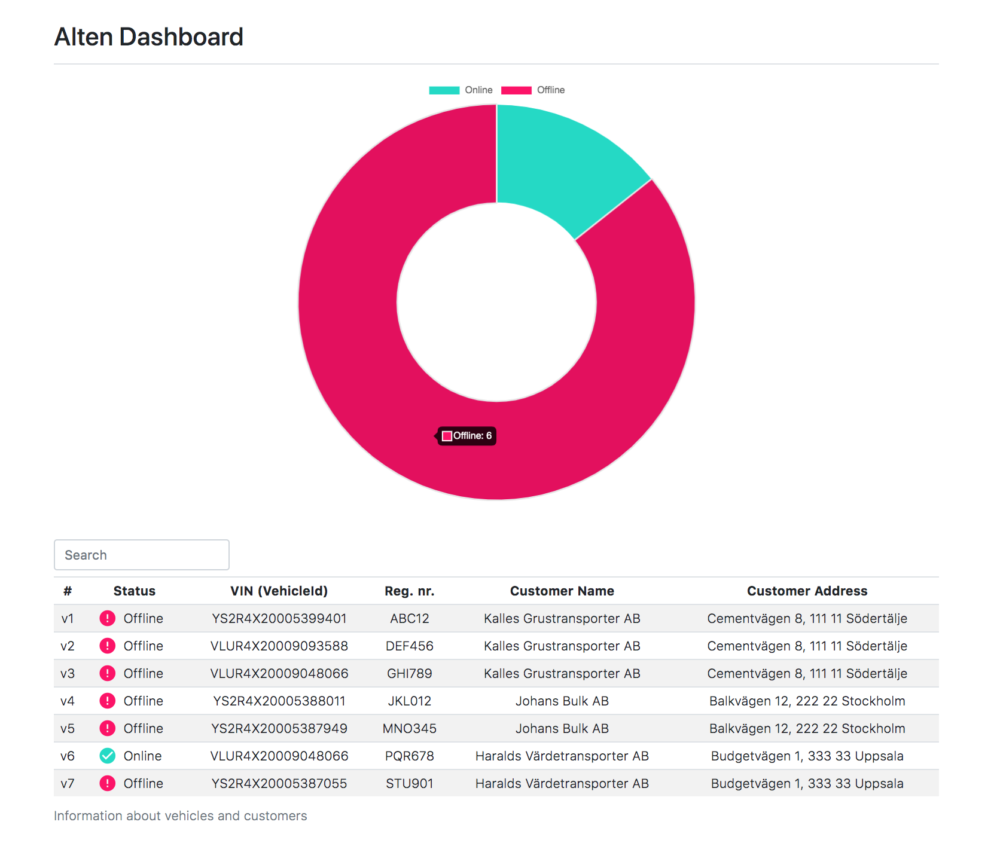
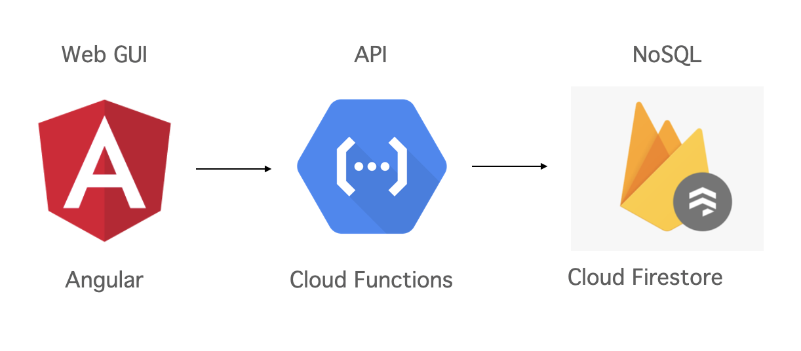
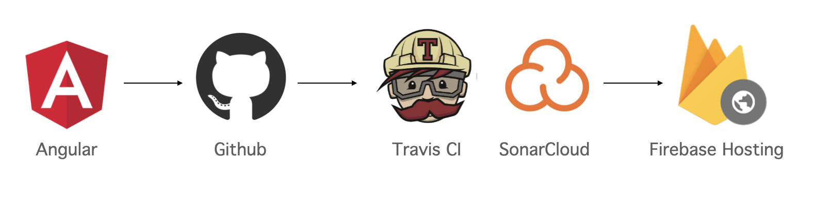
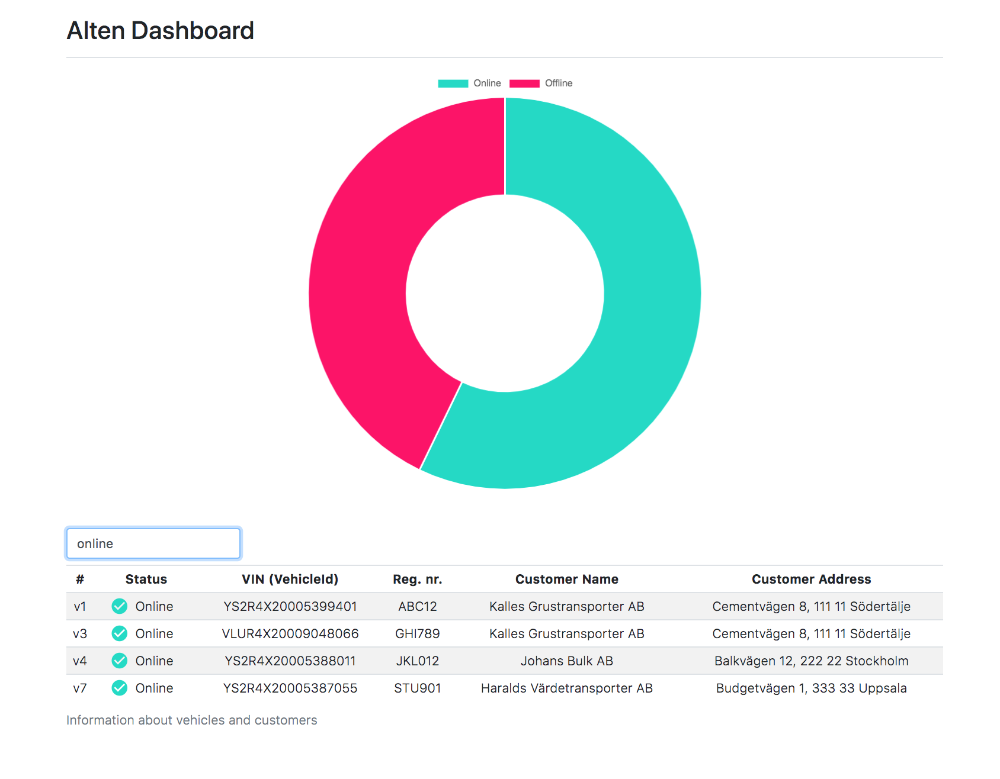

# AltenMonitoring GUI



## Full architecture sketch to solution
This solution is light and flexible by using cloud platform(GCP), microservices architecture(Firebase) and serverless architecture(Cloud functions). So it can be easily extended with new features to give a better user experience. 



* Cloud Firestore: realtime, cloud hosted, NoSQL database
* Cloud Functions: serverless, event driven backend
* Firebase Hosting: global web hosting
* Angular: web application framework
```bash
├── app
│   ├── models                               # models (interfaces)
│   │   ├── customer.ts
│   │   ├── status-counter.ts
│   │   ├── vehicle.ts
│   │   └── vehicle-info.ts
│   ├── monitoring
│   │   ├── monitoring.component.css
│   │   ├── monitoring.component.html        # monitoring html
│   │   ├── monitoring.component.ts          # monitoring component
│   │   └── monitoring.component.spec.ts
│   ├── vehicle-status
│   │   ├── vehicle-status.service.ts        # service logic
│   │   └── vehicle-status.service.spec.ts   # test cases of service logic
│   ├── ..
│   ├── customer.service.ts
│   ├── customer.service.spec.ts
│   ├── search-filter.pipe.ts                # search filter setting
│   ├── search-filter.pipe.spec.ts           # test cases of search filter
│   ├── vehicle.service.ts
│   ├── vehicler.service.spec.ts
│   ├── ..
│   ├── environments
│   └── ..                
├── ..
├── .travis.yml                              # configs of travis & sonarcloud
├── firebase.json                            # configs of firebase
└── ..
```

## How to run the solution
### Run the Web GUI locally

Clone alten-gui and install the dependencies
``` 
$ npm install
$ ng serve
```
Accessing local Web GUI: http://localhost:4200/

### Use Travis CI to verify the code and deploy automatically



```
1. Push changes to master branch
2. Travis CI will be started automatically (Travis CI : https://travis-ci.com/github/jeongahyi/alten-gui )
3. Static analysis (SonarCloud link : https://sonarcloud.io/dashboard?id=jeongahyi_alten-gui )
4. Unit tests (ng test with Karma)
5. Automatically deploy to Firebase hosting when test & build is succeeded
```

### Production URL

Here's the live version of the app : https://alten-tool.web.app/  
(the value automatically refreshs every minute)

\* sample of the app with filtered view


### AltenMonitoring API

This API is serverless function by using 'Cloud Functions for Firebase'.  
(It is written only to SIMULATE the real API)

Below is the source code of this API.  
* Cloud functions firebase: https://github.com/jeongahyi/alten-api
